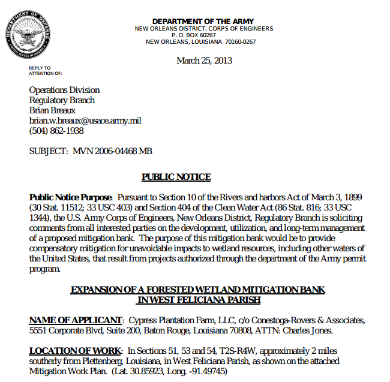
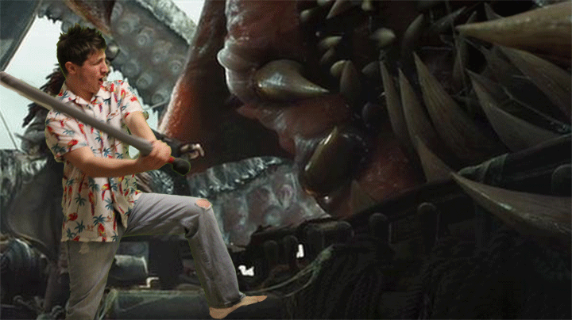
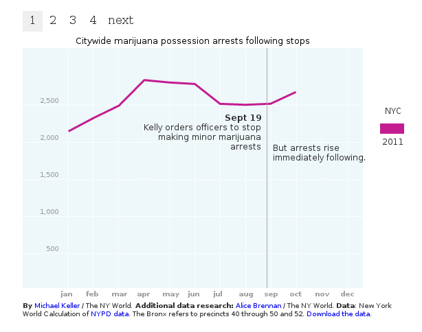
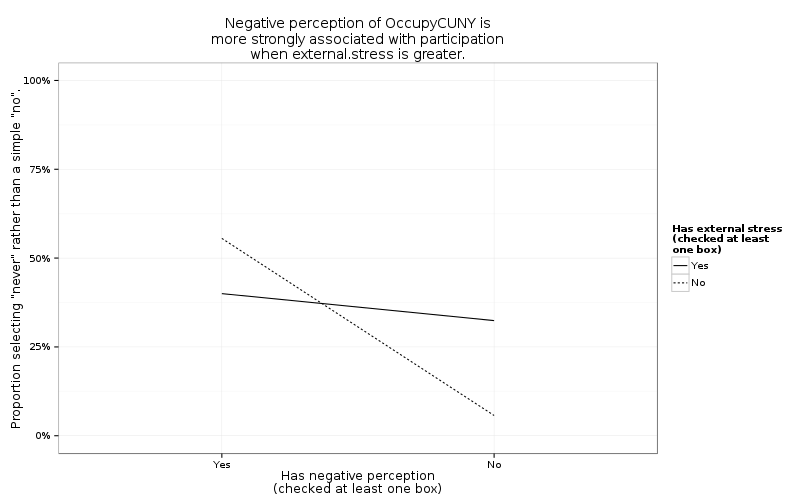
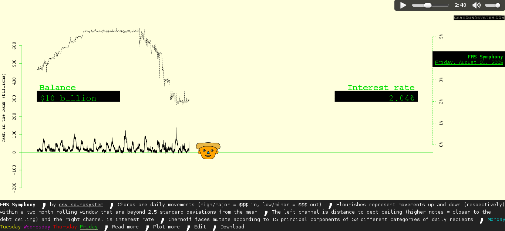
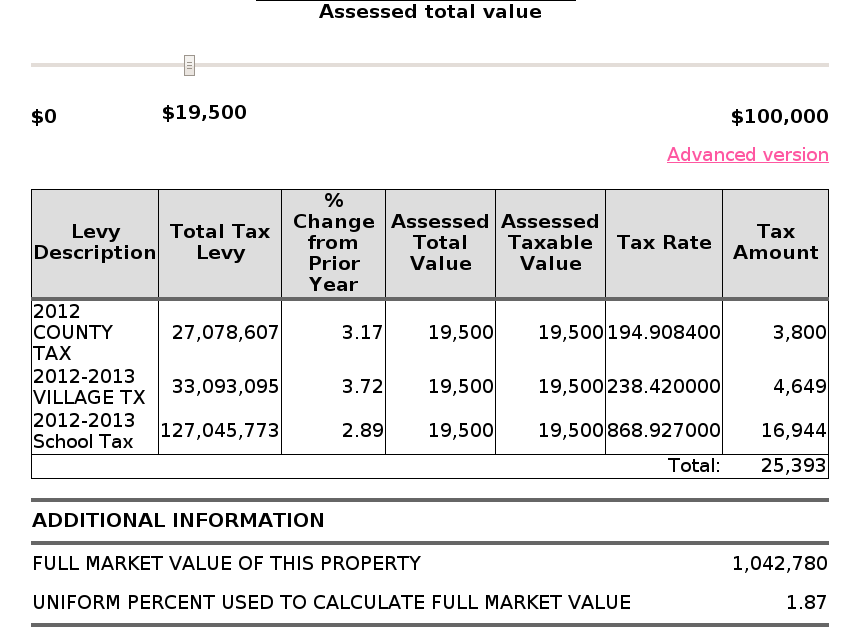
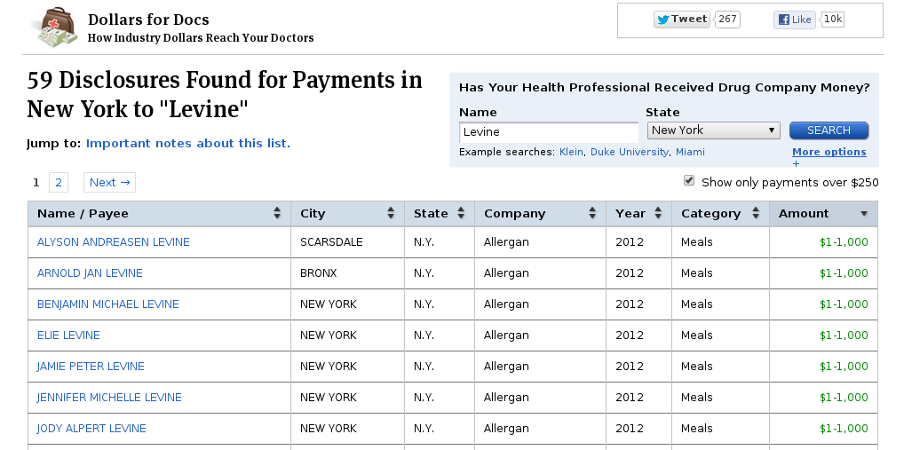
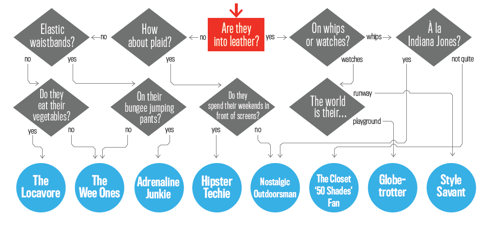

# Interactive data
### Or, what is interactivity?
[Thomas Levine](http://thomaslevine.com)

# zOMG Data!
<!-- CSV is the preferred file format. (http://csvsoundsystem.com) -->

    ID,A1a.participation,A1b_1.petition,A1b_2tshirt,A1b_3.dialogue,A1b_4.rally,A1b_5.direct,A1b_6.other,A1b_6.explain,A1c.issues,A2.extent,A3.education,A4a.motivation,A4b_PBCsupports,A4b_1.financial,A4b_2.job,A4b_3.childcare,A4b_4.belonging,A4b_5.training,A4b_6.schedule,A4b_7.support,A4b_8.work,A4b_9.info,A4b_10.school,A4b_11.other,A4b_11.Explain,A4c_PBCbarriers,A4c_1.financial,A4c_2.jobsecurity,A4c_3.childcare,A4c_4.time,A4c_5.support,A4c_6.work,A4c_7.info,A4c_8.school,A4c_9.surveillance,A4c_10.police,A4c_11.arrest,A4c_12.other,A4c_12.explain,A5.know,A6.describe,A7a.feeloverall,A7b_1.privatization,A7b_2.studentled,A7b_3.movement,A7b_4.common,A7b_5.democratic,A7b_6.nonviolent,A7b_7.direct,A7b_8.other,A7b_8.explain,A7c_1.ineffective,A7c_2.noconcern,A7c_3.unfocused,A7c_4.disruptive,A7c_5.other,A7c_5.explain,A8.ATTEND_YN,A8.DESIRE,A8.attend,A8.explain,A9_INJUSTICE,A9_1.financial,A9_1.explain,A9_2.police,A9_2.explain,A9_3.privatization,A9_3.explain,A9_4.quality,A9_4.explain,A9_5.exclusion,A9_5.explain,A9_6.other,A9_6.explain,A9b_1.financial,A9b_2.social,A9b_3.police,A9b_4.edright,A9b_5.other,A9b_5.explain,B1.CAMPUS,B1.campus_A,B2.Degree,B2.degree_A,B3.Major,B3.major_A,B4_1.day,B4_2.evening,B4_3.online,B4_4.classroom,B4_5.weekend,B4_6.other,B4_6.explain,B5a.typestudent,B5b.leave,B5b.explain,B6.workhoursCODED,B6.workhours,B6.acadhours,B6.unpaid,B7.zipcode,B7b.intersect1,B7b.intersect2,B7c.commute,B8.yearborn,B9_GENDER,B9_1.male,B9_2.female,B9_3.MTF,B9_4.FTM,B9_5.queer,B9_6.Other,B9_6.Explain,B10_SEXUALITY,B10_1.straight,B10_2.bisexual,B10_3.lesbian,B10_4.gay,B10_5.genderqueer,B10_6.asexual,B10_7.notsure,B10_8.other,B10_8.explain,B11_RACE,B11a_1.black,B11a_2.white,B11a_3.asian,B11a_4.nativeam,B11a_5.hispanic,B11a_6.other,B11a_6.explain,B11b.identity,B12a.parent,B12b.caregiver,B13_1.loan,B13_2.grants,B13_3.employment,B13_4.inherit,B13_5.workstudy,B13_6.family,B13_7.GI,B13_8.trust,B13_9.fellowship,B13_10.savings,B13_11.welfare,B13_12.Other,B13_12.Explain,B14a.currentdebt,B14b.futuredebt,B15.international,B16.tuition,B17.disabilities,B17.explain,B18.religion,B18.explain,B19.actcomments,B20.feedback,V154,V155
    KM_30,1,1,1,0,1,0,0, , ,2,2, ,0,0,0,0,0,0,0,0,0,0,0,0, ,5,1,0,0,1,0,0,0,0,1,1,1,0, ,25, ,1,1,0,0,1,0,1,1,0, ,0,0,0,1,0, ,0,1,4,am afraid to go alone & consequences,1,1, ,1, ,1, ,1, ,1, ,0, , , , , , , ,5,Hunter,2,BA,"11, 19",English Literature & Special Honors & Sociology,1,0,0,1,0,0, ,2,2, ,?,15, , ,Hunter dorms,25th,1st,45,1991,2,0,1,0,0,0,0, ,2,0,1,0,0,0,0,0,0, ,18,0,1,0,0,0,1, ,"I am a Jewish Iraqy & German and Israeli, not sure if this makes me non-white--> questioning --> I am definitely less white",0,0,0,0,0,0,0,1,0,0,0,0,0,0, , ,depends (grad school),2,2,2, ,1,Jewish (but not practicing), , , , 
    online_014,2,0,0,0,0,0,0, , ,0,0, ,0,0,0,0,0,0,0,0,0,0,0,0, ,1,0,0,0,0,0,0,0,0,0,0,0,1,I dont believe in the ideas of the OCCUPY movement., ,"Similar to the occupy wall street where they want to take money from the rich and give it to the poor, while the poor dont bother to find jobs...",2,0,0,0,0,0,0,0,0, ,0,0,0,0,1,I dont agree with the idea,0,0,3,I dont agree with the idea,0,0, ,0, ,0, ,0, ,0, ,0, , , , , , , ,9,Medgar Evers college,2,Bachelor of science. Major in Biology,4,Major in Biology,1,1,0,0,0,0, ,2,1,Needed to travel out of the country,3,17, , ,11213, , ,10,1987,1,1,0,0,0,0,0, ,1,1,0,0,0,0,0,0,0, ,18,0,1,0,0,0,1,Jewish,Orthodox Jew,2,2,0,1,0,0,0,0,0,0,0,1,0,0, ,none,"$10,000 once I have finished my bachelors, and an additional $100,000 once I have completed graduate school.",2,1,2, ,1,Jewish community, , , , 
    online_003,1,1,1,1,1,1,1,facilitated trainings,"LGBTQ issues, peace/war, women's rights, social justice and labor issues.",3,1,"the dream of a future where education is a right, accesible, and lived in dignity.",9,1,1,0,1,1,1,1,1,1,1,0, ,0,0,0,0,0,0,0,0,0,0,0,0,0, ,70,It's a ows inspired movement of CUNY students and allies in defense of public higher education (accessibility and quality),1,1,1,1,1,1,1,1,0, ,0,0,0,0,1,it is made into a students' issue but it is really everyone's issue.,1,1,1,they are important.,1,0, ,0, ,0, ,0, ,0, ,1,all of the above, , , , , , ,4,gc,4,phd,19,psychology,0,0,0,0,0,0, ,2,2, ,2,15, , ,11238,franklin,prospect place,45,1982,2,0,1,0,0,0,0, ,5,0,0,0,0,1,0,0,0, ,17,0,0,0,0,1,1,european descent,southamerican/hispanic of italian descent.,2,1,0,0,0,0,0,0,0,0,1,0,0,0, ,0,0,1,2,2, ,2, , , , , 
    DJL_086,1,0,0,1,1,0,0, ,Student budget cuts,3,1,What motivates me is the fact that I feel everybody needs equal learning opportunity,3,1,0,1,1,0,0,0,0,0,0,0, ,0,0,0,0,0,0,0,0,0,0,0,0,0, ,25.8,I would say that Occupy CUNY is basically students and staff who care about education. Verbal fighting for their rights.,1,1,1,1,1,1,1,1,0, ,0,0,0,0,0, ,1,1,1,it was very intriguing and pertains to me.,1,1, ,1, ,1, ,1, ,1, ,0, , , , , , , ,3,Brooklyn College,2,BA,6,Education,1,1,0,1,0,0, ,2,2, ,4,40, , ,11221.,Central,Wilson,80,1992,2,0,1,0,0,0,0, ,1,1,0,0,0,0,0,0,0, ,17,0,0,0,0,1,1, ,Hispanic/West Indian (ethnic identity - latin american),2,2,0,1,0,0,0,0,0,0,0,0,0,0, ,0,0,2,2,2, ,2, , , , , 
    MRW_048,1,1,1,1,1,0,0, ,"Poverty, police brutality, civil rights issues",3,1,"Freedom, rights, privacy, liberty, civil matters",8,1,1,0,1,1,0,1,1,1,1,0, ,0,0,0,0,0,0,0,0,0,0,0,0,0, ,30,Unfocused anger with cause.,1,1,0,0,0,0,1,0,0, ,0,0,0,0,0, ,0,1,4,lack of effective solution,1,1, ,1, ,1, ,1, ,1, ,1,They are all connected., , , , , , ,5,Hunter,2,BA,23,Pol Sci,0,0,0,0,0,1, ,1,1,NA,3,25, , ,11215,7th ave,1 st,40,1985,1,1,0,0,0,0,0, ,1,1,0,0,0,0,0,0,0, ,17,0,0,0,0,1,1, ,Spanish/Mex/PR,2,1,0,0,1,0,0,1,0,0,0,0,0,0, ,25000,30000,2,1,2, ,2, , , , , 
    MRW_055,2,0,0,0,0,0,0, , ,3,2, ,0,0,0,0,0,0,0,0,0,0,0,0, ,1,1,0,0,0,0,0,0,0,0,0,0,0, ,10.4,I don't have much knowledge about it so I wouldn't be able to,4,0,1,0,1,0,0,0,0, ,0,0,0,0,0, ,0,1,4,it has to do with my future education,1,1, ,0, ,0, ,0, ,1, ,0, , , , , , , ,5,Hunter,2,Bachelors,18,Media Studies,0,1,0,0,0,0, ,2,2, ,2,13, , ,11370,77 st,30th ave,45,1992,1,1,0,0,0,0,0, ,1,1,0,0,0,0,0,0,0, ,17,0,0,0,0,1,1, ,"Half Turkish, half Colombian",2,2,0,0,0,0,0,0,0,0,0,1,0,1,financial aid,0, ,2,1,2, ,2, , , , , 
    KM_7,2,0,0,0,0,0,0, , ,5,2, ,0,0,0,0,0,0,0,0,0,0,0,0, ,1,0,0,0,1,0,0,0,0,0,0,0,0, , ,It would be a great idea to help students,1,1,1,0,1,0,1,1,0, ,0,0,0,0,0, ,0,1,4,I need ?,1,1, ,0, ,0, ,1, ,1, ,0, , , , , , , ,9,Medgar Evers,2,BS,4,Biology,1,0,0,1,0,0, ,2,2, ,4,40, , ,11226,?,?,40,1987,2,0,1,0,0,0,0, ,1,1,0,0,0,0,0,0,0, ,16,0,0,0,0,0,1,Haitian,I love being black and I am proud to be Haitian.,2,2,1,1,1,0,0,0,0,0,0,0,0,0, ,20000,30000,2,1,2, ,1,?,?, , , 
    KM_3,1,1,0,0,1,0,1,clothes drive, ,2.5,2, ,0,0,0,0,0,0,0,0,0,0,0,0, ,3,1,0,0,0,1,1,0,0,0,0,0,0, ,0, ,1,1,0,0,0,0,0,0,0, ,0,0,0,0,0, , , , , ,0,0, ,0, ,0, ,0, ,0, ,0, , , , , , , ,9,Medgar Evers,2,BS,4,Biology,0,0,0,0,0,1,whatever fits my schedule,2,2, ,0,0, , ,11236, , ,60,1991,2,0,1,0,0,0,0, ,1,1,0,0,0,0,0,0,0, ,16,1,0,0,0,0,1, ,African,2,2,0,0,0,0,0,0,0,0,0,0,0,1,parernts,0,400000,1,1,2, ,1,Christian, , , , 
    CMP.14,2,0,0,0,0,0,0, , ,2,2, ,0,0,0,0,0,0,0,0,0,0,0,0, ,1,0,0,0,1,0,0,0,0,0,0,0,0, ,4.16, ,4,0,0,0,0,0,0,0,0, ,0,0,0,0,0, ,0,1,4,I don't have much time on my schedule,1,1, ,0, ,0, ,0, ,0, ,0, , , , , , , ,9,MEC,1,AAS,6,education,1,1,0,0,0,0, ,2,2, ,3,17.5, , ,11208,pitkin,liberty,135,1991,2,0,1,0,0,0,0, ,1,1,0,0,0,0,0,0,0, ,15,1,0,0,0,1,0, , ,2,2,0,1,0,0,0,0,0,0,0,0,0,0, ,0, ,2,1,2, ,2, , , , , 
    DJL_016,2,0,0,0,0,0,0, , ,3,0, ,0,0,0,0,0,0,0,0,0,0,0,1,Pro choice,1,0,0,0,0,0,0,0,0,0,1,0,0,less threat from police,16.7, ,1,1,1,1,1,0,0,0,0, ,0,0,0,0,0, ,1,1,1,I care about the future education of CUNY,1,0, ,0, ,0, ,0, ,0, ,0, ,1,1, ,1, , ,5,Hunter,2,BA in Education,29,undecided,1,0,0,0,0,0, ,2,0, ,0,0,8, ,10460.,Southern Blvd,182nd Street,45,1989,4,0,0,0,0,1,0, ,5,0,0,0,0,1,0,0,0, ,14,0,0,0,0,0,1,Afro Latina,"1/2 african american, 1/2 puerto rican.  * this person made a new checkbox and named it ""Afro Latina""",2,2,0,0,1,0,0,0,0,0,0,1,0,0, ,16000,24000,2,1,2, ,2, , , , , 
    CMP.13,2,0,0,0,0,0,0, , ,1,2, ,0,0,0,0,0,0,0,0,0,0,0,0, ,1,0,0,0,1,0,0,0,0,0,0,0,0, ,4.16,I don't know,4,0,0,0,0,0,0,0,0, ,0,0,0,0,0, ,0,0,3,I don't have  time,1,1, ,0, ,0, ,1, ,0, ,0, , , , , , , ,9,MEC,2,BA,11,english,0,1,0,0,0,0, ,2,1,block in applying for classes,3,30, , ,10465,phillip,lafayette,120,1988,2,0,1,0,0,0,0, ,1,1,0,0,0,0,0,0,0, ,14,0,0,0,0,0,0, ,I am of mixed race. I am white and black with other mixtures too.,2,2,0,1,0,0,0,0,0,0,0,0,0,0, ,0,0,2,1,2, ,2, , , , , 
    KM_26,1,0,0,0,1,1,1,camped out in Zucotti,"economic inequality- inequality in general, predatory ?",4,1,"watching family members struggle with no ending debt, sympathy for adjunts who struggle to maintain benefits",7,0,0,0,1,1,1,1,1,1,1,0, ,0,0,0,0,0,0,0,0,0,0,0,0,0, ,83.3,more talk than action; though teachers offer a great deal of support,3,1,0,0,1,0,0,0,1,the fact that the conversation is circulating and that it seems to set a ball in motion (in referene to trying to bring about change) is encouraging,0,0,0,0,0, ,1,0,2,"I'd rather attend occupy teah ins more closely affiliated w/ occupy. The students (in my opinion) had great ideas, but went nowhere w/ them.",1,1, ,1, ,1, ,0,cu,1, ,1,treatment of adjuncts; improving facilities; excessive bonuses for executive members of board of trustees coupled with tuition increases; elimination of offices to create classrooms for more students; underfunding of social scienes, , , , , , ,5,Hunter,2,undergrad,23,media & com/ political science,1,1,0,1,0,0, ,2,2, ,2,12.5, , ,10472,Noble av,aleason av,30-45,1991,2,0,1,0,0,0,0, ,1,1,0,0,0,0,0,0,0, ,14,0,0,0,0,0,1, ,I am human being,2,1,0,1,0,0,0,1,0,0,0,0,0,0, ,"0 but my family members are 50, 000+",hopefully 0,2,1,2, ,2, ,no,no, , 
    DJL_017,1,0,0,0,0,0,0, ,Students for justice in Palestine,5,1,"Yes, inequality motivates me to fight back",1,0,0,0,0,0,0,0,0,0,1,1,Extra class credit def helps but I will do it either way,0,0,0,0,0,0,0,0,0,0,0,0,0, ,100,It is about uniting students together for a free and quality education based on the peoples needs and desires,1,1,1,0,0,1,0,0,1,it's awesome,0,0,0,0,1,Can be unorganized at times,1,1,1,I support the cause,1,0, ,0, ,0, ,0, ,0, ,0, ,1,1,1,1, , ,5,Hunter,2,4 years,12,Film,0,0,0,1,0,0, ,2,0, ,4,40,20,10,6614.,lives in Connecticut, ,140,1993,2,0,1,0,0,0,0, ,1,1,0,0,0,0,0,0,0, ,14,0,0,0,0,0,0, ,Muslim Turkish American,1,2,1,0,0,0,0,0,0,0,0,0,0,0, , , ,2,2,2, ,1,Muslim American society, , , , 
    adh_012,1,1,0,0,0,0,0, ,construction on my block,2,2, ,0,0,0,0,0,0,0,0,0,0,0,0, ,1,0,0,0,1,0,0,0,0,0,0,0,0, ,0,No idea of it!, ,0,0,0,0,0,0,0,0, ,0,0,0,0,0, , , , , ,0,0, ,0, ,0, ,0, ,0, ,0, , , , , , , ,3,Brooklyn College,2,BA,25,Children's studies and speech pathology,1,0,0,0,1,0, ,2,2, ,2,12.5, , ,11223,kings highway,quentin road,60,1992,2,0,1,0,0,0,0, ,1,1,0,0,0,0,0,0,0, ,14,0,0,0,0,0,1, ,Uzbek,2,2,0,0,0,0,0,0,0,0,0,0,0,1,Financial aid,0,0,2,NO,2, ,1,Islam, , , , 
    DJL_071,2,0,0,0,0,0,0, , ,4,2, ,0,0,0,0,0,0,0,0,0,0,0,0, ,1,0,0,0,1,0,0,0,0,0,0,0,0, ,50,My description of Occupy CUNY/activism as advocacy for disability rights for the people who was born with a disability and/or was disabled thereafter I think.,4,0,0,0,0,0,0,0,0, ,0,0,0,0,0, ,0,1,4,my schedule is inflexible at this time.,1,1, ,1, ,1, ,1, ,1, ,0, , , , , , , ,11,School for Professional Studies,3,MA Disability Studies,9,Disability Studies,0,1,1,1,0,0, ,1,1,"Fall 2012 - upon acceptance, the school received my A.A. Degree from Nassau Community College too late. Spring 2012 - class closed.",5,50, , ,11423-2967,Jamaica Ave,198th Street,45,1963,2,0,1,0,0,0,0, ,1,1,0,0,0,0,0,0,0, ,14,0,0,0,0,0,1, ,"I am a woman of Jamaican W.I descent (Born in the USA), who is educated, independent & employed. I care and am committed to helping people (particularly with disabilities)",2,2,0,1,1,0,0,0,0,0,0,0,0,0, ,2200, ,2,1,2, ,1,I was brought up Catholic but I now attend and worship at St. Gabriel's Episcopal Church, , , , 
    DJL_094,1,1,0,0,0,1,0, ,"Budget cuts, tuition increases",2,2, ,0,0,0,0,0,0,0,0,0,0,0,0, ,4,0,1,0,1,0,0,1,0,0,0,1,0, ,25,People are standing up and fighting against the things going on within the CUNY system that are not right & fair,1,0,1,0,1,0,0,1,0, ,1,0,0,0,0, ,1,1,1,it was interesting to see what was said,1,1, ,0, ,0, ,1, ,0, ,0, , , , , , , ,3,Brooklyn College,2,BA,6,Children & Youth studies,1,1,0,0,0,0, ,2,2, ,3,30, , ,10312.,Hylan Blvd,Richmond Ave,120,1990,2,0,1,0,0,0,0, ,1,1,0,0,0,0,0,0,0, ,14,0,0,0,0,0,1, ,Egyptian,2,2,0,1,0,0,0,1,0,0,0,0,0,0, , , ,2,1,2, , , , , , , 
    MRW_058,1,1,1,1,1,0,0, ,"CUNY tuition hikes, Privatization of Hunter College (turnstiles), lack of quality education.",4,1,Free education and educational accessibility for all,8,0,0,1,1,1,1,1,1,1,1,0, ,0,0,0,0,0,0,0,0,0,0,0,0,0, ,31.6, ,1,1,1,1,1,0,1,1,0, ,0,0,0,0,0, ,1,1,1,it promotes mobilization and rally activism,1,1, ,1, ,1, ,1, ,1, ,0, , , , , , , ,5,Hunter College,2,Bachelor of Arts,19,Sociology,1,1,0,1,0,0, ,2,2, ,2,8, , ,11212,Grafton st,Dumont ave,61,1990,1,1,0,0,0,0,0, ,1,1,0,0,0,0,0,0,0, ,14,0,0,0,0,0,1, ,Human Being,2,1,0,1,0,0,0,1,0,0,0,0,0,0, ,0,0,2,1,2, ,2, , , , , 
    CMP.34,1,0,0,0,1,0,0, ,Illegal students in the United States. The rally was in support for a lwa that would give students permission to sttempt to get their legal documemts.,2,2, ,0,0,0,0,0,0,0,0,0,0,0,0, ,2,0,1,0,1,0,0,0,0,0,0,0,0, ,0,I've not heard of it.,4,0,0,0,0,0,0,0,0, ,0,0,0,0,0, ,0,1,4,I first need to learn about it.,1,1, ,0, ,0, ,1, ,0, ,0, , , , , , , ,7,LAGCC,1,AAS,6,childhoodeducation,1,0,0,0,1,0, ,2,2, ,4,34, , ,11373,flushing,morgan,40,1991,1,1,0,0,0,0,0, ,1,1,0,0,0,0,0,0,0, ,14,0,0,0,0,0,0, ,Althought I have a Latin American background I do not engage in it. I was born here and give little pride in ommitting I have more ethnic background. I have pride in my country. The one I was raised in.,1,2,0,1,0,0,0,0,0,0,0,0,0,1,financial aid,0,unknown,2,1,2, ,2, , , , , 
    online_016,2,0,0,0,0,0,0, , ,0,0, ,0,0,0,0,0,0,0,0,0,0,0,0, ,2,1,0,0,1,0,0,0,0,0,0,0,0, ,0, ,4,0,0,0,1,0,0,0,0, ,0,0,0,1,0, ,0,1,4,"I am very busy between school and work, family.",1,1, ,1, ,1, ,1, ,1, ,0, , , , , , , ,0,Math department in the A- building.,2,A BA of science in math,26,Mathematics,0,1,0,1,0,1,Individual study,2,1,financial reasons,5,50, , ,11207,dewitt avenue,van sinderien,27.5,1989,1,1,0,0,0,0,0, , ,1,0,1,0,0,0,0,0, ,14,0,0,0,0,0,1,Human,We are all from one race and thats the human race.,1,1,0,1,0,0,0,0,0,0,0,0,0,0, ,500.00 dollars,00.00 dollars,2,1,2, ,2, , , , , 
    DJL_081,1,1,1,0,1,0,0, ,"Re-distribution of school funds, tuition hikes, anti-bullying, women's rights",4,2, ,0,0,0,0,0,0,0,0,0,0,0,0, ,3,1,0,0,1,0,0,1,0,0,0,0,0, ,50,it's against the tuition hikes,4,0,1,1,1,0,0,0,0, ,1,0,1,0,1,Not accessible to everyone,0,1,4,I have not received any information,1,1, ,0, ,0, ,1, ,1, ,0, , , , , , , ,3,Brooklyn College,2,BA,"6, 19",Psychology & Children & Youth Studies,1,1,0,1,0,0, ,2,2, ,3,20, , ,11213.,Crown,Troy,45,1991,2,0,1,0,0,0,0, ,1,1,0,0,0,0,0,0,0, ,14,0,0,0,0,0,0, ,"Danish, Iroquois, liberalish Southerner",2,2,0,0,0,0,0,1,0,0,0,0,0,1,scholarship,0,30000,2,2,2, ,1, Catholic,Make it more accessible and show that it is effective & more students would be willing to participate, , , 
    CMP.23,2,0,0,0,0,0,0, , ,3,0, ,0,0,0,0,0,0,0,0,0,0,0,0, ,1,0,0,0,0,0,0,1,0,0,0,0,0, ,4.16, ,4,0,0,0,0,0,0,0,0, ,0,0,0,0,0, , , , , ,0,0, ,0, ,0, ,0, ,0, ,0, , , , , , , ,9,Mec/Brooklyn,2,BA,5,business,0,1,0,0,1,0, ,1,2, ,5,50, , ,11226,bedford,rogers,15,1972,2,0,1,0,0,0,0, ,2,1,1,1,1,0,0,0,0, ,14,0,0,0,0,0,1, , ,1,2,1,0,1,0,1,0,0,0,0,0,0,0, ,3000,15000,2,1,2, ,2, , , , , 
    MRW_057,2,0,0,0,0,0,0, , ,3,0, ,0,0,0,0,0,0,0,0,0,0,0,0, ,1,0,0,0,0,1,0,0,0,0,0,0,0, ,0, ,4,0,0,0,0,0,0,0,0, ,0,0,0,0,0, ,0,1,4, ,0,0, ,0, ,0, ,0, ,0, ,0, , , , , , , ,5,Hunter,2,BA,12,Film,1,1,0,1,0,0, ,2,1,I was sick,4,35, , ,11103,44 st,34 ave,30,1980,2,0,1,0,0,0,0, ,1,1,0,0,0,0,0,0,0, ,14,0,0,0,0,0,1, ,I am Brazilian,2,2,0,0,1,0,0,1,0,0,0,0,0,0, ,3000, ,1,2,2, ,2, , , , , 
    DJL_021,1,0,0,0,0,0,0, ,Students United for a free CUNY. Students for Justice in Palestine,5,1,Access for Black & Latino Students! We need to build factories of revolution.,1,0,0,0,0,0,0,1,0,0,0,0,Teachers let me miss classes for activism,0,0,0,0,0,0,0,0,0,0,0,0,0, ,100,"Important! We are building a movement for a free, accessible, democratic CUNY",1,0,1,0,0,0,0,0,0, ,0,0,0,0,0, ,1,1,1,it is a fight worth fighting!,1,0, ,0, ,0, ,0, ,0, ,0, ,1, , ,1, , ,5,Hunter,2,BA,29,undecided,0,0,0,0,0,0, ,2,0, ,2,15,20,15,10010.,25th street,1st ave,30,1993,1,1,0,0,0,0,0, ,1,1,0,0,0,0,0,0,0, ,14,0,0,0,0,0,0, ,Jewish: Half white - half Arab,2,2,0,1,0,0,0,0,0,0,0,0,0,0, ,0,0,2,1,2, ,2, , , , , 
    DJL_054,1,0,0,0,0,0,0, ,California Student Sustainability Coalition,4,1,Creating learning environments in/out of classrooms that prepare people of all ages to live healthy lives w/o oppression,3,1,0,0,0,0,1,0,0,0,0,1,Income from job w/ flexible hours.,0,0,0,0,0,0,0,0,0,0,0,0,0, ,41.7,Students organizing to expose & transform issues of access to education and degree completion.,1,1,1,0,1,0,0,0,0, ,0,0,0,0,0, ,0,1,4,Event times conflict with schedule,0,0, ,0, ,0, ,0, ,0, ,0, , , , , , , ,4,Grad Center,4,PhD,19,Psychology,1,0,0,1,0,1,Research,2,0, ,3,20,20,15,11105.,24th Ave,23rd st,45,1985,1,1,0,0,0,0,0, ,1,1,0,0,0,0,0,0,0, ,14,0,0,0,0,0,0, ,mixed race,2,2,0,0,0,0,0,0,0,0,1,0,0,0, ,0,0,2,1,2, ,2, ,Activism on specific days/times is important. But there should be ways to be an activist everyday!, , , 
    DJL_064,1,1,1,0,1,1,0, ,Animal rights/LGBT rights,4,2, ,0,0,0,0,0,0,0,0,0,0,0,0, ,1,0,0,0,0,0,0,0,0,0,0,0,1,I don't care,93.8,self explanatory,3,0,0,0,0,0,0,0,1,I don't care,1,1,0,0,0, ,0,0,3,It's irrelevant,0,0, ,0, ,0, ,0, ,0, ,0, , , , , , , ,0,N/A,3,MBA,5,International Business,1,0,0,0,0,0, ,2,2, ,1,0, , ,10009.,1st ave,"2nd ave, 19th st",30,1990,2,0,1,0,0,0,0, ,2,0,1,0,0,0,0,0,0, ,14,0,0,0,0,0,1, , ,2,2,0,0,0,0,0,1,0,0,0,0,0,0, ,0,0,2,1,2, ,2, , , , , 
    DJL_063,1,0,0,0,0,0,0, ,Latin American Solidarity,5,0, ,1,0,0,0,0,0,0,0,0,0,0,1,Love for humanity,0,0,0,0,0,0,0,0,0,0,0,0,0, ,77.1,"There have been systematic cuts that affect the GC community, students in particular.  No democracy without public education as we learn from Chile",1,1,0,0,0,0,0,0,0, ,0,0,0,0,0, ,1,1,1, ,0,0, ,0, ,0, ,0, ,0, ,0, , , , , , , ,0, , , ,0, ,0,0,0,0,0,0, ,2,0, ,0,0, , , , , , , ,4,0,0,0,0,0,1,None,8,0,0,0,0,0,0,0,1,None,14,0,0,0,0,0,1,Citizen of the world, ,2,2,0,0,0,0,0,0,0,0,0,0,0,0, , , , , ,2, , , ,Thanks!!, , , 

## Everything becomes data

## Oh no! Data!
<!-- notmuch show --format=raw --part=1 id:AANLkTinDUJQWrrQY2Ac+UVaVfdn1PeVDOsGCRoywf469@mail.gmail.com | munpack -->

How can we tame the data rather than fighting them?

## "Interactives"
"Interactives" can apparently help us make sense of data.

# Is this interactive?
<!-- For each of some examples, ask the question and have people raise hands. -->
Answer with

* Yes
* No
* Stupid question, unsure, abstain, &c.

## Stop, Question, Frisk

## [Popes](http://blogs.lanacion.com.ar/data/herramientas/todos-los-papas-en-un-timeline-js/)
<iframe src="http://embed.verite.co/timeline/?source=0AifB8e3wY7YKdEd4N25RMjRNdjBHYnNtdzlNZnlnb0E&font=Bevan-PotanoSans&maptype=toner&lang=es&start_at_slide=270&width=645&height=650" width="100%" height="100%" frameborder="0"></iframe>

## Motivators of Protest

# Why is this (not) interactive?
<!-- For each of the same examples, ask people why they thought so. -->

an example

another example

another example

# Flashy pseudo interactivity

Show

a few

examples

## FMS Symphony

# Story-telling
I think interactivity is about finding your own stories.

## Reading your tax bill
[]http://thomaslevine.com/!/scarsdale-tax-bill/)

## Dollars for Docs

## Holiday gift guide

...

# Summarizing Tom's theory about the word "interactivity"
* When people seek "interactivity", they want to create or find their own stories.
* Flashy things with movement give people an illusion of personalized story-telling.
* Under this definition, static text or image can be interactive.
